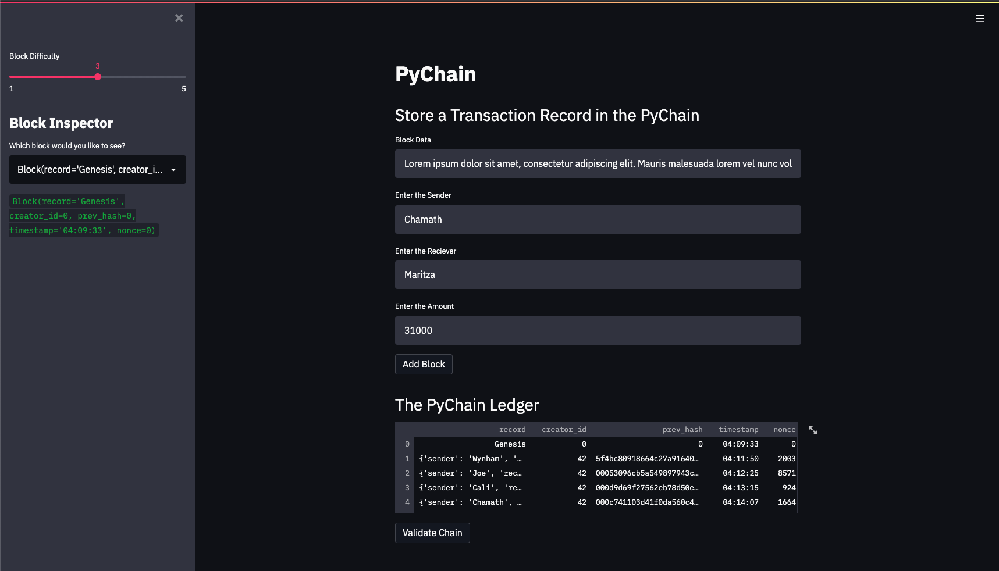
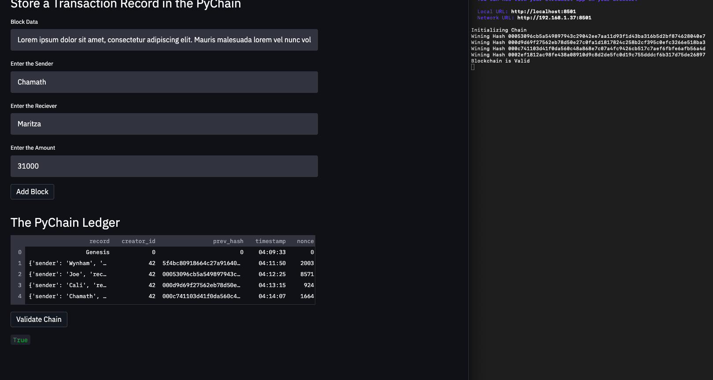
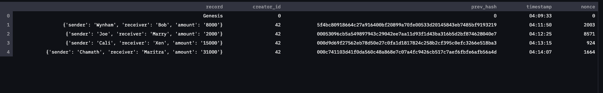

# Module 18 Challenge

This is the repository for my module 18 challenge. In this module challenge, we displayed the fundamentals of creating a blockchain based ledger system. For this specific use case, we wanted to build a ledger that allows banks to share financial transactions.

Our first step in this challenge was to create a new dataclass, which we called 'Record'. This dataclass included the attributes: 'sender', 'reciever', and 'amount'.  

The second step was to modify the existing 'Block' dataclass to store record data. This way, we incorporate the dataclass created in the first step.

In the next step, we added the relevant user inputs to the streamlit interface, so that when the user enters information, it gets stored in the 'Block' record. The inputs are for 'sender', 'reciever', and 'amount'.

In the final step, we tested the PyChain ledger by running the streamlit application and storing some of the mined blocks in the ledger. The images are displayed below in the 'Example' section of the Readme.

---

## Technologies

Import the following at the beginning of pychain.py file:

```python
import streamlit as st
from dataclasses import dataclass
from typing import Any, List
import datetime as datetime
import pandas as pd
import hashlib
```

---

## Example

#### This first image shows the layout of the streamlit application.




#### This next image shows what happens when the user presses 'Validate Chain'. In the Streamlit application the value True is returned, and in the terminal it states 'Blockchain is Valid'.




#### This final image shows a close up of all the transactions in the PyChain ledger. You're able to access this by pressing the expand button in the Streamlit application




---

## Contributors

UCB Fintech Bootcamp, Wynham Guillemot 

---

## License

MIT License

Copyright (c) [2021] [UCB Fintech Bootcamp, Wyham Guillemot]

Permission is hereby granted, free of charge, to any person obtaining a copy
of this software and associated documentation files (the "Software"), to deal
in the Software without restriction, including without limitation the rights
to use, copy, modify, merge, publish, distribute, sublicense, and/or sell
copies of the Software, and to permit persons to whom the Software is
furnished to do so, subject to the following conditions:

The above copyright notice and this permission notice shall be included in all
copies or substantial portions of the Software.

THE SOFTWARE IS PROVIDED "AS IS", WITHOUT WARRANTY OF ANY KIND, EXPRESS OR
IMPLIED, INCLUDING BUT NOT LIMITED TO THE WARRANTIES OF MERCHANTABILITY,
FITNESS FOR A PARTICULAR PURPOSE AND NONINFRINGEMENT. IN NO EVENT SHALL THE
AUTHORS OR COPYRIGHT HOLDERS BE LIABLE FOR ANY CLAIM, DAMAGES OR OTHER
LIABILITY, WHETHER IN AN ACTION OF CONTRACT, TORT OR OTHERWISE, ARISING FROM,
OUT OF OR IN CONNECTION WITH THE SOFTWARE OR THE USE OR OTHER DEALINGS IN THE
SOFTWARE.
